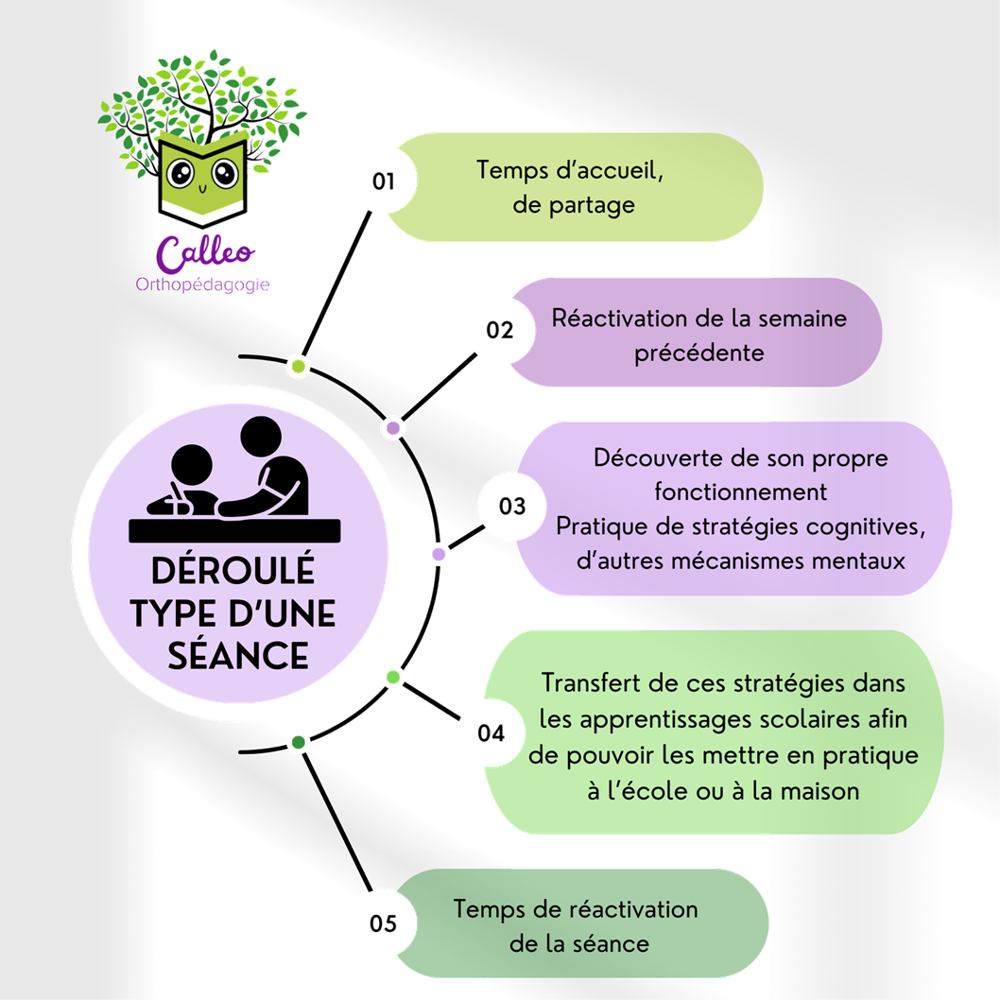

### En cabinet
>Un premier entretien nous permet d’échanger sur motif de votre demande, sur le parcours
de votre enfant et vos inquiétudes.\\
>Puis j’observe en situation les stratégies et les mécanismes mentaux de votre
enfant afin d’identifier ses points d’appui et les défis à relever.\\
>Enfin, j’établis un plan d’intervention adapté dans le but de développer les
stratégies d’apprentissage qui le feront progresser à la hauteur de ses capacités.\\
**Le suivi orthopédagogique a lieu au cours de séances hebdomadaires d’une heure.**

#### Déroulé type d’une séance
{:class="center"}

### Au sein d'une structure (association, structure municipale, établissement scolaire)
>Ateliers en petits groupes au sein de votre structure. Ils ont pour but de : 
* découvrir le fonctionnement de son cerveau lors des apprentissages
* renforcer certaines fonctions exécutives (fonctions cérébrales essentielles aux apprentissages) 
* proposer une méthodologie avancée pour un travail personnel plus efficace. 
>
>Chaque atelier s'articule autour :
* de jeux de société ciblés, de vidéos, d'activités spécifiques, de mises en situation... 
* et d'un dialogue orthopédagogique (métacognitif) qui amène au transfert vers les apprentissages scolaires.

<!--  #### Modules Primaires 6-8 ans -->
{:class="center"}

<!-- #### Modules Primaires 8-10 ans -->
{:class="center"}

<!-- #### Modules Collège -->
{:class="center"}

[Me contacter]({{site.url}}{{site.baseurl}}/#contact) pour un devis et établir le contenu détaillé des modules adaptés sur mesure à votre structure.